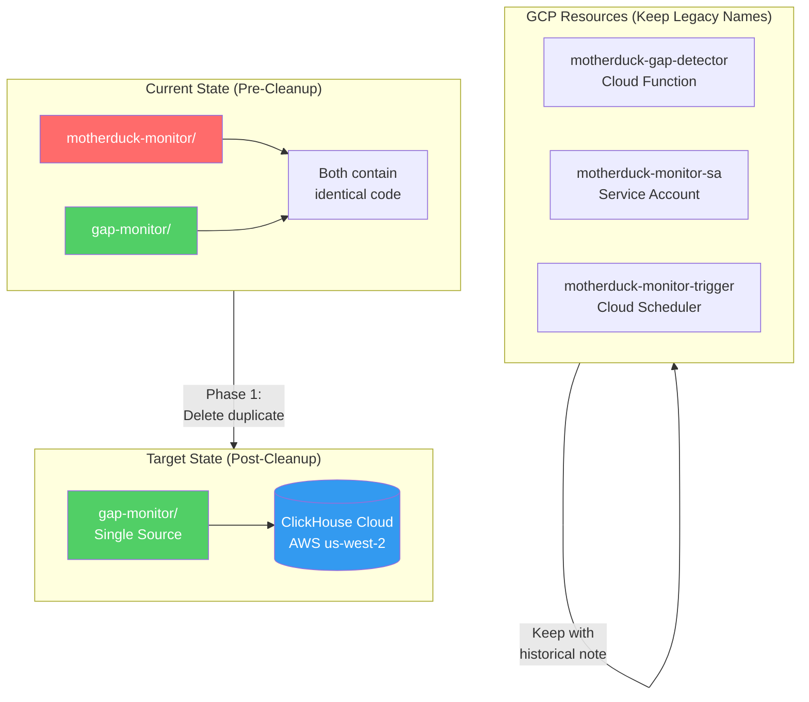

# ADR: MotherDuck to ClickHouse Naming and Documentation Cleanup

**Status**: Accepted
**Date**: 2025-11-29
**Deciders**: Terry Li
**Design Spec**: [spec.md](/docs/design/2025-11-29-motherduck-clickhouse-cleanup/spec.md)

## Context

The migration from MotherDuck to ClickHouse was completed on 2025-11-25 (MADR-0013). However, naming and documentation cleanup was deferred. The codebase now contains:

- 66 files with MotherDuck references
- Duplicate directories (`motherduck-monitor/` and `gap-monitor/`)
- GCP resources with legacy "motherduck" names
- Broken skill references to non-existent `motherduck-pipeline-operations`
- Documentation stating MotherDuck is current storage (incorrect)

### Motivation

1. **Developer Confusion**: New contributors see "MotherDuck" everywhere but system uses ClickHouse
2. **Broken References**: Skills reference scripts that no longer exist
3. **Maintenance Burden**: Duplicate directories require parallel updates
4. **Security Hygiene**: Unused `motherduck-token` secret remains in GCP

### Why It Matters

- Code integrity: Documentation should match implementation
- Onboarding: Clear naming reduces ramp-up time
- Operational safety: Unused secrets are attack surface

## Decision

Implement a **phased cleanup** that prioritizes safety over completeness:

### Phase 1: Safe Changes (No GCP Impact)

- Delete duplicate `motherduck-monitor/` directory (identical to `gap-monitor/`)
- Delete unused `motherduck-token` GCP secret
- Fix historical note in README to reflect actual GCP resource names
- Update service account display name for clarity

### Phase 2: Documentation Updates

- **Full rewrites** for 9 files with substantial MotherDuck content
- Find-replace updates for 15 files with simple terminology swaps
- Fix broken ADR link in architecture README

### Phase 3: GCP Resource Renaming (Deferred)

**Decision: Skip renaming GCP resources.**

Rationale:

- Cloud Functions, Scheduler Jobs, Service Accounts cannot be renamed in-place
- Recreation requires downtime and IAM reconfiguration
- Current names are internal identifiers with no user-facing impact
- Code already works correctly with ClickHouse

## Architecture

## User Decisions (Plan Mode)

| Question                                                           | Decision          | Rationale                                                                                         |
| ------------------------------------------------------------------ | ----------------- | ------------------------------------------------------------------------------------------------- |
| Documentation strategy for 9 files requiring substantial rewrites? | **Full rewrites** | User prioritized accuracy over speed. Deprecation notices would leave confusing outdated content. |

## Consequences

### Positive

- Single source of truth for gap monitor code
- Documentation matches implementation
- Reduced attack surface (unused secret removed)
- Clear historical context preserved in README

### Negative

- GCP resource names remain "motherduck" (cosmetic only)
- ~3 hours of documentation rewrite effort
- Historical ADRs/changelogs still reference MotherDuck (by design)

### Risks Mitigated

- All code changes are git-tracked (instant rollback via `git revert`)
- GCP secret can be recreated from 1Password backup
- No production downtime during cleanup

## Implementation

See [Design Spec](/docs/design/2025-11-29-motherduck-clickhouse-cleanup/spec.md) for detailed implementation plan with success criteria.

## References

- [MotherDuck to ClickHouse Migration ADR](/docs/architecture/decisions/2025-11-25-motherduck-clickhouse-migration.md)
- [Gap Monitor README](/deployment/gcp-functions/gap-monitor/README.md)
- [Two-Tier Gap Alerting Strategy](/docs/design/2025-11-29-gap-alerting-strategy/spec.md)
