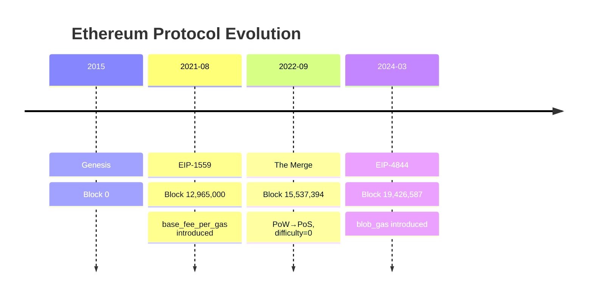
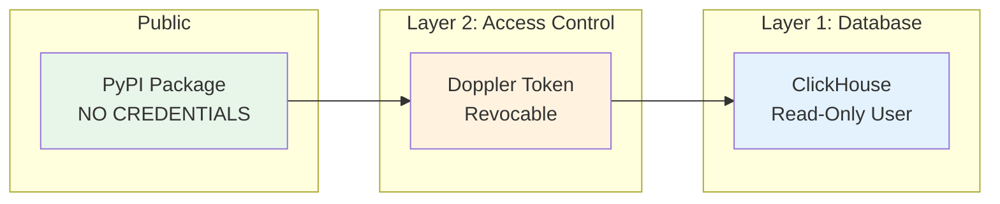

# Alpha Features API Design

## Status

Accepted

## Date

2025-11-28

## Context

The `gapless-network-data` package exposes Ethereum block data via ClickHouse Cloud. For AI coding agent consumption (Claude Code CLI), we need:

1. **Opinionated feature rankings** - Guide ML/forecasting users toward high-value features
2. **Deprecated feature handling** - Exclude `difficulty`/`total_difficulty` (zero post-Merge Sep 2022)
3. **AI discoverability** - `probe.py` module for agent introspection
4. **Double-layer security** - ClickHouse read-only user + Doppler service token

### Ethereum Protocol Eras



### Alpha Feature Ranking

| Rank | Feature             | Type    | Predictive Value | Availability |
| ---- | ------------------- | ------- | ---------------- | ------------ |
| #1   | `base_fee_per_gas`  | Raw     | Highest          | Post-EIP1559 |
| #2   | `block_utilization` | Derived | High             | All blocks   |
| #3   | `transaction_count` | Raw     | Medium           | All blocks   |
| #4   | `block_interval`    | Derived | Medium           | All blocks   |
| #5   | `avg_tx_size`       | Derived | Low              | All blocks   |
| #6   | `base_fee_velocity` | Derived | Medium           | Post-EIP1559 |
| #7   | `blob_utilization`  | Derived | Medium           | Post-EIP4844 |

### Deprecated Features

| Feature            | Reason              | Recommendation     |
| ------------------ | ------------------- | ------------------ |
| `difficulty`       | Always 0 post-Merge | Exclude by default |
| `total_difficulty` | Frozen post-Merge   | Exclude by default |

## Decision

### API Design

```python
def fetch_blocks(
    start: str | None = None,
    end: str | None = None,
    limit: int | None = None,
    include_deprecated: bool = False,  # Opinionated default
) -> pd.DataFrame
```

- **Column order**: Traditional (timestamp first) - rankings via `probe.get_alpha_features()`
- **Return format**: pandas DataFrame (per gapless-crypto-clickhouse)
- **Deprecated exclusion**: `include_deprecated=False` by default

### AI Discoverability

```python
# probe.py - AI agent introspection
probe.get_alpha_features()   # Ranked features with python_code
probe.get_setup_workflow()   # Credential setup for coworkers
probe.get_capabilities()     # Package capabilities
```

### Data Access Architecture (Double-Layer Security)



**Credential Flow:**

1. Admin creates ClickHouse read-only user (SELECT only)
2. Admin stores credentials in Doppler (`gapless-network-data/team` config)
3. Admin creates Doppler service token, stores in 1Password
4. Coworker gets token from 1Password, runs `doppler configure set token`
5. Package resolves credentials via Doppler CLI

## Consequences

### Positive

- AI agents get ranked feature guidance via `probe.get_alpha_features()`
- Deprecated features excluded by default (prevents misuse)
- Double-layer security protects ClickHouse from unauthorized access
- Credential workflow documented in `probe.get_setup_workflow()`

### Negative

- Coworkers need Doppler CLI and 1Password access
- Additional setup steps vs environment variables

### Mitigation

- `probe.get_setup_workflow()` provides step-by-step guidance
- Clear error messages with setup instructions on credential failure

## Related

- [MotherDuck to ClickHouse Migration](/docs/architecture/decisions/2025-11-25-motherduck-clickhouse-migration.md)
- [gapless-crypto-clickhouse](https://github.com/terrylica/gapless-crypto-clickhouse) - Referential implementation
- [Plan](/docs/development/plan/2025-11-28-alpha-features-api/plan.md) - Detailed implementation plan
