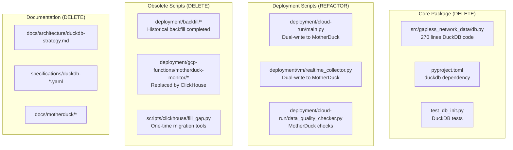

# Pre-Merge DuckDB/MotherDuck Code Elimination

## Status

Accepted

## Date

2025-11-28

## Context

After completing ClickHouse migration (ADR 2025-11-25), the codebase still contains extensive DuckDB/MotherDuck legacy code that is no longer used. Before merging `migrate-to-clickhouse` branch to `main`, this technical debt must be eliminated.

**Legacy Code Inventory**:

**Current State**:

- SDK queries ClickHouse via `api.py` (operational)
- `db.py` module is 100% DuckDB code with no active imports
- Deployment scripts dual-write to both MotherDuck and ClickHouse
- 50+ files contain DuckDB references

## Decision

Perform aggressive cleanup:

1. **DELETE** all DuckDB-specific code (`db.py`, tests, obsolete scripts)
2. **REMOVE** MotherDuck code paths from dual-write deployment scripts
3. **DELETE** obsolete documentation (DuckDB strategy, MotherDuck docs)
4. **STANDARDIZE** type hints to modern `X | None` syntax (PEP 604)
5. **CLEAN** build artifacts and update `.gitignore`

**Cleanup Scope**:

| Category | Action                   | Files                |
| -------- | ------------------------ | -------------------- |
| DELETE   | Remove obsolete files    | 23 files             |
| REFACTOR | Remove MotherDuck code   | 3 deployment scripts |
| UPDATE   | Type hints, docs, config | 8 files              |

## Consequences

**Positive**:

- Clean codebase with single database target (ClickHouse)
- Reduced complexity in deployment scripts
- No unused dependencies (`duckdb` removed from pyproject.toml)
- Modern, consistent type hint syntax

**Negative**:

- Loss of local DuckDB fallback option (acceptable - SDK is cloud-first)
- Historical migration scripts deleted (acceptable - migration complete)

**Risks**:

- Breaking existing imports → Mitigated by verifying no active imports of `db.py`
- Breaking tests → Mitigated by running full test suite after cleanup

## Implementation

**Plan**: [Pre-Merge Cleanup Plan](/docs/development/plan/2025-11-28-pre-merge-duckdb-cleanup/plan.md)

**Execution Order**:

1. Clean build artifacts (no code impact)
2. Delete core DuckDB code
3. Refactor deployment scripts
4. Standardize type hints
5. Delete obsolete documentation
6. Clean skills directory
7. Verify and commit
