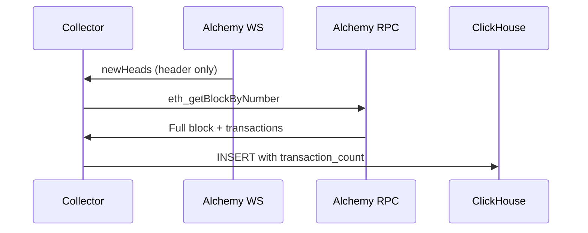

# Real-Time Collector Transaction Count Fix

## Status

Accepted

## Date

2025-11-28

## Context

After migrating to ClickHouse (see [MotherDuck to ClickHouse Migration](/docs/architecture/decisions/2025-11-25-motherduck-clickhouse-migration.md)), we observed that recent blocks in ClickHouse had `transaction_count = 0` while historical blocks (from BigQuery) had correct values.

Investigation revealed that `eth_subscribe newHeads` WebSocket notifications only return block headers - they do NOT include the `transactions` array. The VM collector's `parse_block()` function was using:

```python
transaction_count = len(block_data.get('transactions', []))  # Always 0!
```

This is a known limitation of the Ethereum JSON-RPC spec. All block indexers (Etherscan, The Graph, etc.) use a two-step pattern:

1. Subscribe to `newHeads` for real-time notifications
2. Call `eth_getBlockByNumber` to fetch full block data



## Decision

Implement the standard block indexer pattern in `deployment/vm/realtime_collector.py`:

1. Add `ALCHEMY_HTTP_URL` for JSON-RPC calls (alongside existing WebSocket URL)
2. Add `fetch_full_block(block_number_hex)` function that calls `eth_getBlockByNumber`
3. Modify block processing: `newHeads notification → eth_getBlockByNumber → parse → insert`

**RPC Cost Analysis:**

- Ethereum: ~300 blocks/hour (12s intervals)
- `eth_getBlockByNumber`: ~15-25 CU/call
- Monthly overhead: 216,000 calls × 25 CU = 5.4M CU/month
- Alchemy free tier: 300M CU/month
- **Impact: <2% of free tier** - negligible

## Consequences

### Positive

- Accurate `transaction_count` for all real-time blocks
- Data parity with historical BigQuery data
- Standard pattern used by all production indexers

### Negative

- ~300 additional RPC calls/hour (negligible vs 300M/month free tier)
- Slight latency increase (~50-100ms per block for HTTP call)

### Mitigation

- Latency is acceptable for 12-second block intervals
- If rate limits become an issue, can batch requests (unlikely)

## Validation

After deploying fix:

```sql
-- Verify recent blocks have non-zero transaction_count
SELECT number, transaction_count
FROM ethereum_mainnet.blocks FINAL
WHERE timestamp > now() - INTERVAL 1 HOUR
ORDER BY number DESC
LIMIT 10
```

## Related

- [MotherDuck to ClickHouse Migration](/docs/architecture/decisions/2025-11-25-motherduck-clickhouse-migration.md)
- [Gap Detector ClickHouse Fix](/docs/architecture/decisions/2025-11-26-gap-detector-clickhouse-fix.md)
- [`realtime_collector.py`](/deployment/vm/realtime_collector.py) - Collector source code
